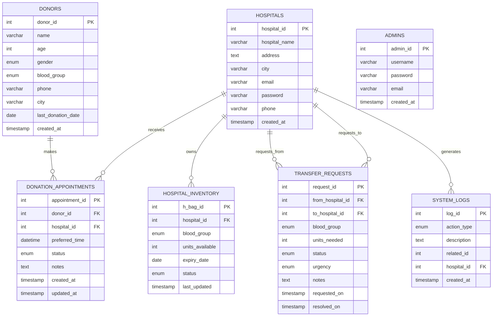

# Blood Network System - ER Diagram

## Entity Relationship Diagram (Mermaid)

## Relational Schema

### 1. DONORS
- **Primary Key**: donor_id
- **Attributes**: name, age, gender, blood_group, phone, city, last_donation_date, created_at
- **Constraints**: age BETWEEN 18 AND 65, phone UNIQUE

### 2. HOSPITALS
- **Primary Key**: hospital_id
- **Attributes**: hospital_name, address, city, email, password, phone, created_at
- **Constraints**: hospital_name UNIQUE, email UNIQUE

### 3. DONATION_APPOINTMENTS
- **Primary Key**: appointment_id
- **Foreign Keys**: 
  - donor_id → DONORS(donor_id)
  - hospital_id → HOSPITALS(hospital_id)
- **Attributes**: preferred_time, status, notes, created_at, updated_at

### 4. HOSPITAL_INVENTORY
- **Primary Key**: h_bag_id
- **Foreign Keys**: hospital_id → HOSPITALS(hospital_id)
- **Attributes**: blood_group, units_available, expiry_date, status, last_updated
- **Constraints**: units_available >= 0

### 5. TRANSFER_REQUESTS
- **Primary Key**: request_id
- **Foreign Keys**: 
  - from_hospital_id → HOSPITALS(hospital_id)
  - to_hospital_id → HOSPITALS(hospital_id)
- **Attributes**: blood_group, units_needed, status, urgency, notes, requested_on, resolved_on
- **Constraints**: units_needed > 0

### 6. SYSTEM_LOGS
- **Primary Key**: log_id
- **Foreign Keys**: hospital_id → HOSPITALS(hospital_id)
- **Attributes**: action_type, description, related_id, created_at

### 7. ADMINS
- **Primary Key**: admin_id
- **Attributes**: username, password, email, created_at
- **Constraints**: username UNIQUE, email UNIQUE

## Key Relationships

1. **One-to-Many**: DONORS → DONATION_APPOINTMENTS
2. **One-to-Many**: HOSPITALS → DONATION_APPOINTMENTS
3. **One-to-Many**: HOSPITALS → HOSPITAL_INVENTORY
4. **Many-to-Many**: HOSPITALS ↔ HOSPITALS (via TRANSFER_REQUESTS)
5. **One-to-Many**: HOSPITALS → SYSTEM_LOGS

## Business Rules

1. Donors must be 18-65 years old
2. Donors can only donate every 90 days
3. Blood units expire after 35-42 days
4. Hospitals can request blood from other hospitals
5. Transfer requests require approval from destination hospital
6. All actions are logged in SYSTEM_LOGS
7. Admin cannot interfere with blood operations